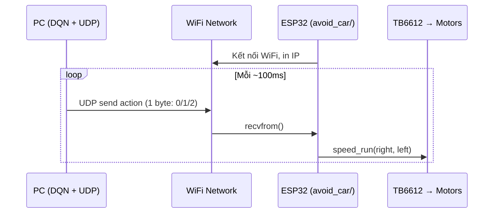

# Avoid Car — Truyền Tín Hiệu Chuyển Động Xuống Xe Thực (WiFi)

PC chạy DQN inference → gửi action qua **WiFi UDP** → ESP32 nhận → điều khiển motor.

## So sánh tốc độ

| Thông số | Simulation | Xe thực (`src_code`) | Avoid car (đề xuất) |
|----------|-----------|---------------------|---------------------|
| Tốc độ chạy thẳng | `max_v = 20.0 px/s` | `SPEED_DEFAULT = 170` (0–255) | `SPEED_FORWARD = 170` |
| Góc rẽ mỗi action | `delta_steer = 0.3 rad` (~17°) | PD controller liên tục | Differential drive |
| Timestep | `dt = 0.1s` (100ms/step) | `LOOP_DELAY = 5ms` | `~100ms` (match sim) |
| Tốc độ lùi/rẽ | N/A | `SPEED_REVERSE = -40` | `SPEED_TURN_SLOW = 50` |

## Quyết định đã xác nhận

- ✅ **WiFi (UDP)** — không dây
- ✅ **Chỉ truyền tín hiệu chuyển động** — ESP32 là actuator, PC là brain
- ✅ **Không cần mode** — firmware riêng cho avoid car
- ✅ **Tốc độ**: dùng `170` (giống `SPEED_DEFAULT` của line follower)

---

## Cấu trúc file

```
avoid_car/
├── config.py              # [NEW] Cấu hình motor pins + WiFi + speed
├── motor.py               # [NEW] Copy từ src_code/motor.py
├── action_driver.py       # [NEW] Map action (0,1,2) → motor speed
├── wifi_comm.py           # [NEW] WiFi UDP receiver trên ESP32
├── main.py                # [NEW] Entry point ESP32
├── pc_sender.py           # [NEW] PC-side: inference + UDP send
├── simulation_repo/car/   # DQN simulation (không sửa)
└── workflow/              # Docs, PNG
```

---

## Proposed Changes

### [NEW] [config.py](file:///media/mamapapa/Ubuntu/line_follower_car/avoid_car/config.py)

```python
# ── Motor pins (giống src_code/config.py) ──
PIN_PWMA = 18; PIN_AIN1 = 21; PIN_AIN2 = 19   # Motor A (Left)
PIN_PWMB = 5;  PIN_BIN1 = 15; PIN_BIN2 = 2    # Motor B (Right)
PWM_FREQ = 1000; PWM_MAX_DUTY = 1023; SPEED_SCALE = 255

# ── Speed (match simulation ratio) ──
SPEED_FORWARD   = 170    # Chạy thẳng (giống SPEED_DEFAULT)
SPEED_TURN_FAST = 170    # Bánh ngoài khi rẽ
SPEED_TURN_SLOW = 50     # Bánh trong khi rẽ

# ── WiFi ──
WIFI_SSID = "YOUR_SSID"
WIFI_PASS = "YOUR_PASSWORD"
UDP_PORT  = 8888

# ── Button ──
PIN_BUTTON = 23
```

---

### [NEW] [motor.py](file:///media/mamapapa/Ubuntu/line_follower_car/avoid_car/motor.py)

Copy nguyên từ `src_code/motor.py`, chỉ sửa `from config import ...` cho config local.

---

### [NEW] [action_driver.py](file:///media/mamapapa/Ubuntu/line_follower_car/avoid_car/action_driver.py)

```python
class ActionDriver:
    """Map simulation CarAction → differential drive.
    
    speed_run(right, left) convention từ src_code/motor.py:
      FORWARD(0):    right=170, left=170
      TURN_LEFT(1):  right=170, left=50   (phải nhanh → xe quay trái)
      TURN_RIGHT(2): right=50,  left=170  (trái nhanh → xe quay phải)
    """
    def execute(self, action: int): ...
    def stop(self): ...
```

---

### [NEW] [wifi_comm.py](file:///media/mamapapa/Ubuntu/line_follower_car/avoid_car/wifi_comm.py)

```python
class WiFiComm:
    """ESP32 WiFi UDP receiver.
    
    1. Kết nối WiFi (STA mode)
    2. Bind UDP socket port 8888
    3. Non-blocking recvfrom() → nhận 1 byte action (0/1/2)
    """
    def connect(self): ...        # Kết nối WiFi, in IP
    def read_action(self) -> int | None: ...  # Non-blocking
```

---

### [NEW] [main.py](file:///media/mamapapa/Ubuntu/line_follower_car/avoid_car/main.py)

```python
"""Entry point ESP32 — nhận action qua WiFi, điều khiển motor."""
# 1. Init motor, action_driver, wifi
# 2. Kết nối WiFi → in IP address
# 3. Loop: read_action() → execute() → emergency stop check
```

---

### [NEW] [pc_sender.py](file:///media/mamapapa/Ubuntu/line_follower_car/avoid_car/pc_sender.py)

Script Python chạy trên PC (không phải MicroPython):

```python
"""PC: chạy DQN inference → gửi action qua UDP → ESP32."""
import socket
# 1. Load DQN model
# 2. Tạo UDP socket, target = ESP32_IP:8888
# 3. Loop: inference → sock.sendto(bytes([action]), (ESP32_IP, 8888))
```

---

## Architecture



---

## Verification Plan

1. **WiFi connection**: ESP32 kết nối WiFi, in IP address lên Serial monitor
2. **UDP echo test**: PC gửi byte, ESP32 nhận và print ra Serial
3. **Kê xe lên**: gửi `0` → 2 bánh quay đều, `1` → rẽ trái, `2` → rẽ phải
4. **Test mặt phẳng**: sequence `[0,0,0,1,0,0,2,0]` → thẳng-trái-phải-thẳng

---

## ✅ Implementation Status

**Completed**: 2026-05-25

### Files Created

#### ESP32 Firmware (`avoid_car/esp32/`)
- ✅ `config.py` — Motor pins, WiFi, speeds, timing
- ✅ `motor.py` — Motor driver (copy từ src_code)
- ✅ `action_driver.py` — Action → motor speed mapping
- ✅ `wifi_comm.py` — WiFi STA + UDP receiver
- ✅ `main.py` — Entry point với safety features
- ✅ `README.md` — Setup instructions

#### PC Sender (`avoid_car/pc/`)
- ✅ `sender.py` — Demo mode + DQN integration template
- ✅ `README.md` — Usage instructions

#### Documentation
- ✅ `avoid_car/README.md` — Complete setup guide

### Key Features Implemented

1. **WiFi UDP Communication**
   - Non-blocking UDP receiver
   - 100ms loop delay (match simulation dt=0.1s)
   - Robust error handling

2. **Safety Features**
   - UDP timeout (500ms) → auto stop
   - Emergency stop button (GPIO23)
   - Non-blocking main loop

3. **Action Mapping**
   - FORWARD (0): both wheels 170
   - TURN_LEFT (1): right=170, left=50
   - TURN_RIGHT (2): right=50, left=170

4. **Demo Mode**
   - Test sequence for verification
   - Easy to replace with DQN inference

### Next Steps for User

1. **Setup ESP32**
   - Fill WiFi credentials in `esp32/config.py`
   - Flash firmware to ESP32
   - Note IP address from Serial monitor

2. **Setup PC**
   - Fill ESP32 IP in `pc/sender.py`
   - Run demo mode: `python sender.py`

3. **Testing**
   - WiFi connection test
   - UDP echo test
   - Motor test (kê xe lên)
   - Sequence test (mặt phẳng)

4. **Integration**
   - Replace demo loop with DQN inference
   - Load trained model from `simulation_repo/car/export/model/`
   - Connect environment state → action → ESP32
