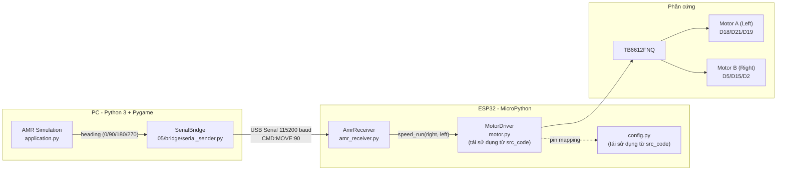

# Truyền Điều Khiển AMR Mô Phỏng → Xe Thực Tế (ESP32)

## Mô tả vấn đề

Code mô phỏng AMR trong `05/` đã hoàn thiện. Robot mô phỏng di chuyển trên lưới 15×15 với 4 hướng: **RIGHT (0°)**, **DOWN (90°)**, **LEFT (180°)**, **UP (270°)**. Mỗi timestep, Dijkstra quyết định hướng tiếp theo → robot thực hiện `moveForward()`.

**Mục tiêu**: Mỗi khi robot mô phỏng thực hiện một bước di chuyển, gửi lệnh tương ứng xuống xe ESP32 thực tế qua Serial (USB), để xe thật di chuyển giống xe mô phỏng.

> [!IMPORTANT]
> Không cần deploy bản đồ thực tế. Chỉ cần mirror lệnh di chuyển: mô phỏng sang phải → xe thật sang phải.

---

## Phần cứng hiện có

Dựa trên [workflow/README.md](file:///media/mamapapa/Ubuntu/line_follower_car/workflow/README.md), xe sử dụng các kết nối sau:

### ESP32 ↔ TB6612FNQ (Motor Driver)

| ESP32 Pin | TB6612FNQ Pin | Chức năng |
|---|---|---|
| **D18** | PWMA | Tốc độ Motor A (Left) |
| **D21** | AIN1 | Chiều quay Motor A |
| **D19** | AIN2 | Chiều quay Motor A |
| **D5** | PWMB | Tốc độ Motor B (Right) |
| **D15** | BIN1 | Chiều quay Motor B |
| **D2** | BIN2 | Chiều quay Motor B |
| 3v3 | STBY | Standby (luôn bật) |
| 3v3 | VCC | Nguồn logic |

### Nguồn điện
- **Pin 18650** → **LM2596** (hạ áp) → **ESP32 Vin** (nguồn logic)
- **Pin 18650** → **TB6612 VM** trực tiếp (nguồn motor)

### Nút nhấn
- **D23** → Signal (pull-up, nhấn = LOW)

> [!NOTE]
> Pin mapping này **hoàn toàn khớp** với [src_code/config.py](file:///media/mamapapa/Ubuntu/line_follower_car/src_code/config.py) và [src_code/motor.py](file:///media/mamapapa/Ubuntu/line_follower_car/src_code/motor.py) hiện có. Sẽ **tái sử dụng trực tiếp** 2 file này cho ESP32-side, không cần viết lại driver motor.

---

## Kiến trúc tổng thể



---

## Phân tích lệnh di chuyển trong mô phỏng

Trong [application.py](file:///media/mamapapa/Ubuntu/line_follower_car/05/core/application.py#L246-L261), mỗi timestep robot nhận `next_action = (next_row, next_col, next_dir)`:

| `next_dir` | Ý nghĩa mô phỏng | Lệnh xe thật |
|---|---|---|
| `0` (RIGHT) | Di chuyển sang phải | Quay phải → tiến thẳng |
| `90` (DOWN) | Di chuyển xuống dưới | Giữ hướng → tiến thẳng |
| `180` (LEFT) | Di chuyển sang trái | Quay trái → tiến thẳng |
| `270` (UP) | Di chuyển lên trên | Quay ngược → tiến thẳng |

> [!NOTE]
> Xe mô phỏng "teleport" giữa các ô. Xe thật cần **quay hướng trước** (nếu khác hướng hiện tại) rồi **tiến thẳng một đoạn cố định**. ESP32 tự xử lý logic quay + tiến khi nhận lệnh `CMD:MOVE:<dir>`.

---

## Giao thức Serial (PC ↔ ESP32)

**Baudrate**: 115200 · **Data**: 8N1 · **Mode**: Synchronous (đợi ACK)

### PC → ESP32:
```
CMD:MOVE:<dir>\n        # Di chuyển theo hướng tuyệt đối (0/90/180/270)
CMD:STOP\n              # Dừng xe
CMD:PING\n              # Kiểm tra kết nối
```

### ESP32 → PC:
```
ACK:MOVE:<dir>\n        # Đã hoàn thành di chuyển
ACK:STOP\n              # Đã dừng
ACK:PING\n              # Pong
ERR:<message>\n         # Lỗi
```

> [!IMPORTANT]
> **Synchronous mode**: Mô phỏng gửi lệnh → đợi ACK từ ESP32 (xe thật hoàn thành di chuyển) → mới tiếp tục timestep tiếp theo. Đảm bảo xe thật đi chính xác theo mô phỏng.

---

## Proposed Changes

### Component 1: Serial Bridge — PC-side

#### [NEW] `05/bridge/__init__.py`

File init rỗng.

---

#### [NEW] [serial_sender.py](file:///media/mamapapa/Ubuntu/line_follower_car/05/bridge/serial_sender.py)

Module Python (CPython) gửi lệnh di chuyển qua Serial. Dùng thư viện `pyserial`.

```python
class SerialBridge:
    def __init__(self, port='/dev/ttyUSB0', baudrate=115200, timeout=3)
    def connect(self) -> bool          # Mở Serial port
    def disconnect(self)               # Đóng Serial port
    def is_connected(self) -> bool     # Kiểm tra trạng thái
    def send_move(self, direction: int) -> bool   # Gửi CMD:MOVE:<dir>, đợi ACK
    def send_stop(self) -> bool        # Gửi CMD:STOP
    def ping(self) -> bool             # Gửi CMD:PING, đợi ACK:PING
    def _send_and_wait_ack(self, cmd: str, expected_ack: str) -> bool
```

**Xử lý lỗi:**
- Timeout 3 giây cho ACK → retry 1 lần → báo lỗi
- Nếu mất kết nối → set `hardware_enabled = False`, simulation tiếp tục chạy không gửi lệnh

---

#### [NEW] [bridge_config.py](file:///media/mamapapa/Ubuntu/line_follower_car/05/bridge/bridge_config.py)

```python
SERIAL_PORT = '/dev/ttyUSB0'    # Linux default (user adjust khi cần)
SERIAL_BAUDRATE = 115200
SERIAL_TIMEOUT = 3              # Timeout đợi ACK (giây)
```

---

### Component 2: ESP32 Command Receiver — MicroPython

Tái sử dụng `config.py` + `motor.py` từ `src_code/` cho pin mapping và motor driver. Chỉ thêm module receiver mới.

#### [NEW] [amr_receiver.py](file:///media/mamapapa/Ubuntu/line_follower_car/05/esp32_amr/amr_receiver.py)

Module MicroPython nhận lệnh từ UART và điều khiển motor:

```python
class AmrReceiver:
    def __init__(self, motor: MotorDriver):
        self.motor = motor
        self.current_heading = 90   # Ban đầu hướng DOWN (giống simulation)
    
    def run_loop(self):
        """Main loop: đọc UART → parse → execute → gửi ACK"""
    
    def execute_move(self, target_dir: int):
        """Quay đến hướng target_dir rồi tiến thẳng 1 bước"""
        self._turn_to(target_dir)
        self._move_forward()
        self.current_heading = target_dir
    
    def _turn_to(self, target_dir: int):
        """Quay xe từ current_heading đến target_dir"""
        # Tính góc quay: diff = (target - current) % 360
        # diff == 0:   không quay
        # diff == 90:  quay phải 90°  → motor.speed_run(+speed, -speed)
        # diff == 180: quay 180°      → motor.speed_run(+speed, -speed) × 2
        # diff == 270: quay trái 90°  → motor.speed_run(-speed, +speed)
    
    def _move_forward(self):
        """Tiến thẳng 1 bước → motor.speed_run(+speed, +speed)"""
```

**Mapping quay xe → motor commands** (dùng `speed_run(right, left)` từ motor.py):

| Hành động | Motor Right | Motor Left | Thời gian |
|---|---|---|---|
| Quay phải 90° | `−TURN_SPEED` | `+TURN_SPEED` | `TURN_90_MS` |
| Quay trái 90° | `+TURN_SPEED` | `−TURN_SPEED` | `TURN_90_MS` |
| Quay 180° | `−TURN_SPEED` | `+TURN_SPEED` | `TURN_90_MS × 2` |
| Tiến thẳng | `+MOTOR_SPEED` | `+MOTOR_SPEED` | `MOVE_FWD_MS` |

> [!WARNING]
> Chiều quay motor ở bảng trên dựa trên logic trong [motor.py](file:///media/mamapapa/Ubuntu/line_follower_car/src_code/motor.py#L58-L78) (dương = tiến, âm = lùi). **Cần test thực tế** để xác nhận chiều quay đúng trên xe.

---

#### [NEW] [amr_config.py](file:///media/mamapapa/Ubuntu/line_follower_car/05/esp32_amr/amr_config.py)

```python
# === Motor speed ===
MOTOR_SPEED = 170           # Tốc độ tiến thẳng (0-255, scale Arduino)
TURN_SPEED = 150            # Tốc độ quay tại chỗ (0-255)

# === Timing (CẦN CALIBRATE trên xe thật!) ===
MOVE_FWD_MS = 800           # Thời gian tiến 1 bước (ms)
TURN_90_MS = 500            # Thời gian quay 90° (ms)

# === Hướng ban đầu ===
INITIAL_HEADING = 90        # DOWN - giống simulation (robot bắt đầu hướng xuống)
```

> [!CAUTION]
> **`TURN_90_MS` cần calibrate!** Giá trị 500ms là ước lượng. Cách calibrate:
> 1. Đặt xe thẳng trên mặt phẳng
> 2. Gửi lệnh quay phải 90°
> 3. Đo góc quay thực tế
> 4. Chỉnh `TURN_90_MS` cho đến khi xe quay đúng 90°
> 
> Sẽ có **script calibration** hỗ trợ (xem Component 4).

---

#### [NEW] [main.py](file:///media/mamapapa/Ubuntu/line_follower_car/05/esp32_amr/main.py)

Entry point MicroPython cho ESP32 ở chế độ AMR:

```python
from motor import MotorDriver       # Tái sử dụng từ src_code/
from amr_receiver import AmrReceiver

def main():
    print("=== AMR RECEIVER MODE ===")
    motor = MotorDriver()
    motor.stop()
    
    receiver = AmrReceiver(motor)
    
    try:
        receiver.run_loop()      # Loop vô hạn đọc UART
    except KeyboardInterrupt:
        pass
    finally:
        motor.stop()
        motor.deinit()

main()
```

---

### Component 3: Tích hợp vào Simulation

Hook gửi lệnh được thêm vào **cả hai** version (OOP + Procedural).

#### [MODIFY] [application.py](file:///media/mamapapa/Ubuntu/line_follower_car/05/core/application.py) — OOP version

```diff
 # Trong __init__():
+from bridge.serial_sender import SerialBridge
+self.bridge = SerialBridge()
+self.hardware_enabled = False

 # Trong event handling — thêm phím tắt:
+elif event.type == pygame.KEYDOWN:
+    if event.key == pygame.K_h:
+        # Toggle hardware connection
+        if not self.hardware_enabled:
+            if self.bridge.connect():
+                self.hardware_enabled = True
+                print("[HW] Connected to ESP32")
+        else:
+            self.bridge.disconnect()
+            self.hardware_enabled = False
+            print("[HW] Disconnected")

 # Trong SIMULATION phase (line ~257-258):
 self.amr.heading = next_dir
 self.amr.moveForward(self.amr.speed)
+
+# Gửi lệnh xuống xe thật
+if self.hardware_enabled and self.bridge.is_connected():
+    if not self.bridge.send_move(next_dir):
+        print("[HW] Command failed, disabling hardware")
+        self.hardware_enabled = False
```

---

#### [MODIFY] [application.py](file:///media/mamapapa/Ubuntu/line_follower_car/05/procedure/application.py) — Procedural version

Tương tự OOP, thêm `bridge` và `hardware_enabled` vào app dict:

```diff
 # Trong create_application():
+from bridge.serial_sender import SerialBridge
+    'bridge': SerialBridge(),
+    'hardware_enabled': False,

 # Trong run() — thêm xử lý phím H:
+if event.type == pygame.KEYDOWN and event.key == pygame.K_h:
+    # Toggle hardware...

 # Trong update_simulation() — sau khi amr.move_forward():
 amr.move_forward(app['robot'], speed)
+if app['hardware_enabled'] and app['bridge'].is_connected():
+    app['bridge'].send_move(next_dir)
```

---

### Component 4: Script Calibration

#### [NEW] [calibrate_turn.py](file:///media/mamapapa/Ubuntu/line_follower_car/05/esp32_amr/calibrate_turn.py)

Script MicroPython upload lên ESP32 để calibrate thời gian quay:

```python
# Cho phép user test quay phải/trái với các giá trị TURN_90_MS khác nhau
# Menu interactive qua REPL:
#   1. Quay phải 90°
#   2. Quay trái 90°
#   3. Quay 180°
#   4. Tiến thẳng 1 bước
#   5. Chỉnh TURN_90_MS
#   6. Chỉnh MOVE_FWD_MS
#   7. Chỉnh MOTOR_SPEED / TURN_SPEED
#   0. Thoát
```

---

### Component 5: Upload Script

#### [NEW] [upload_amr.sh](file:///media/mamapapa/Ubuntu/line_follower_car/05/upload_amr.sh)

Script bash upload code AMR receiver lên ESP32 (tương tự `upload.sh` hiện có):

```bash
#!/bin/bash
# 1. Xóa file cũ trên ESP32
# 2. Upload: config.py, motor.py (từ src_code/)
# 3. Upload: amr_config.py, amr_receiver.py, main.py (từ esp32_amr/)
# 4. Reset ESP32
```

---

## Cấu trúc thư mục sau khi thêm

```
05/
├── bridge/                        ← [NEW] PC-side serial communication
│   ├── __init__.py
│   ├── bridge_config.py           ← Serial port config
│   └── serial_sender.py           ← Gửi lệnh qua USB Serial
├── esp32_amr/                     ← [NEW] ESP32-side MicroPython
│   ├── amr_config.py              ← Timing/speed config (cần calibrate)
│   ├── amr_receiver.py            ← Nhận lệnh UART + điều khiển motor
│   ├── calibrate_turn.py          ← Script calibration interactive
│   └── main.py                    ← Entry point ESP32
├── upload_amr.sh                  ← [NEW] Script upload lên ESP32
├── core/
│   └── application.py             ← [MODIFY] Thêm bridge hook + phím H
├── procedure/
│   └── application.py             ← [MODIFY] Thêm bridge hook + phím H
└── ...
```

**Files upload lên ESP32:**

| File nguồn (PC) | Đích trên ESP32 | Ghi chú |
|---|---|---|
| `src_code/config.py` | `:config.py` | Tái sử dụng — pin mapping TB6612 |
| `src_code/motor.py` | `:motor.py` | Tái sử dụng — MotorDriver class |
| `05/esp32_amr/amr_config.py` | `:amr_config.py` | Timing/speed AMR |
| `05/esp32_amr/amr_receiver.py` | `:amr_receiver.py` | Command receiver |
| `05/esp32_amr/main.py` | `:main.py` | Entry point mới |

---

## Dependency mới

### PC-side (thêm vào `05/pyproject.toml`):
```
pyserial >= 3.5
```

### ESP32-side:
Không cần thêm — dùng `machine.UART` có sẵn trong MicroPython.

---

## Thứ tự triển khai

| Bước | Mô tả | Priority |
|---|---|---|
| 1 | Tạo `05/bridge/` — SerialBridge + config | 🔴 Cao |
| 2 | Tạo `05/esp32_amr/` — AmrReceiver + config + main | 🔴 Cao |
| 3 | Tạo `05/esp32_amr/calibrate_turn.py` | 🟡 Trung bình |
| 4 | Modify `05/core/application.py` — thêm hook | 🔴 Cao |
| 5 | Modify `05/procedure/application.py` — thêm hook | 🔴 Cao |
| 6 | Tạo `05/upload_amr.sh` | 🟡 Trung bình |
| 7 | Test end-to-end | 🔴 Cao |

---

## Verification Plan

### Automated Tests (không cần phần cứng)
1. **Import test**: `from bridge.serial_sender import SerialBridge` không lỗi
2. **Protocol test**: Verify format lệnh `CMD:MOVE:90\n` đúng
3. **Simulation test**: Chạy simulation với `hardware_enabled=False` → không crash, hoạt động bình thường

### Manual Tests (cần ESP32 cắm USB)
1. **Loopback test**: `mpremote run` → gửi `CMD:PING` → nhận `ACK:PING`
2. **Motor test**: Gửi `CMD:MOVE:0` → xe quay phải + tiến thẳng
3. **Calibration**: Chạy `calibrate_turn.py` → chỉnh `TURN_90_MS` cho đúng 90°
4. **Sequence test**: Gửi chuỗi `MOVE:0 → MOVE:270 → MOVE:180 → MOVE:90` → xe đi hình vuông
5. **Full integration**: Chạy simulation → nhấn `H` để kết nối → chọn goal → xe thật đi theo
